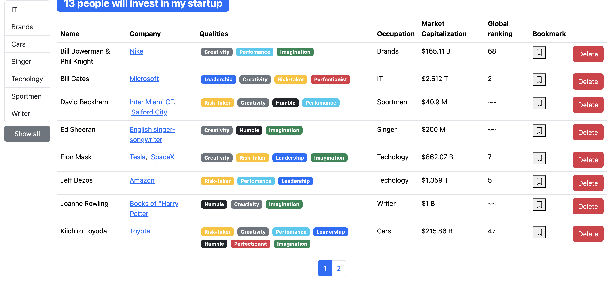

# 📊 Market Capitalization Viewer

=======

A sleek React web app for visualizing and analyzing the market capitalization of companies. Built with **React** and **Bootstrap**.

## 💡 About

This project helps users understand the scale and value of various companies by comparing their market capitalizations in a clean, interactive UI.

## ⚙️ Tech Stack

- **Frontend**: React
- **Styling**: Bootstrap
- **Bundler**: Babel
- **Deployment**: Vercel

## 🌐 Live Demo

👉 [Click here to view the live site](https://project-git-main-vladikhans-projects.vercel.app/)

## 📸 Screenshots

